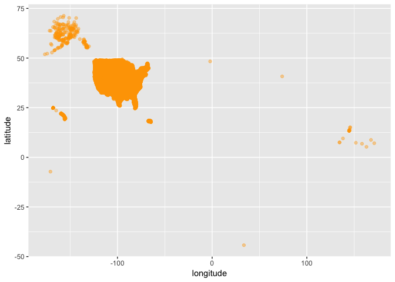
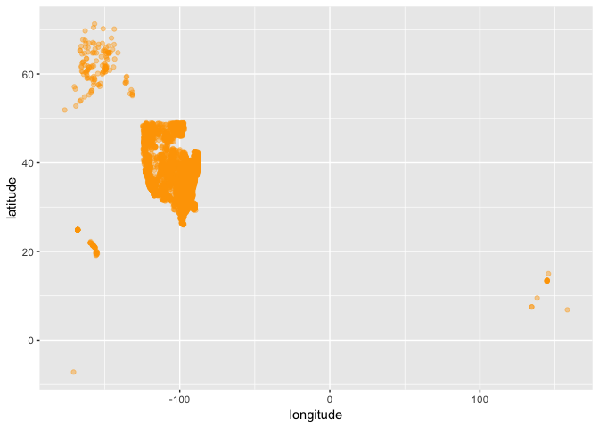

housing
================
Ilya
12/8/2018

#### install packages

    ## Loading required package: sp

    ## Loading required package: ggplot2

Zillow data -- single family homes, zip code -- more lines of this than for neighborhood so perhaps this is smaller spatial scale
=================================================================================================================================

``` r
Z= read.csv("Zip_Zhvi_SingleFamilyResidence.csv")
names(Z)
```

    ##   [1] "RegionID"   "RegionName" "City"       "State"      "Metro"     
    ##   [6] "CountyName" "SizeRank"   "X1996.04"   "X1996.05"   "X1996.06"  
    ##  [11] "X1996.07"   "X1996.08"   "X1996.09"   "X1996.10"   "X1996.11"  
    ##  [16] "X1996.12"   "X1997.01"   "X1997.02"   "X1997.03"   "X1997.04"  
    ##  [21] "X1997.05"   "X1997.06"   "X1997.07"   "X1997.08"   "X1997.09"  
    ##  [26] "X1997.10"   "X1997.11"   "X1997.12"   "X1998.01"   "X1998.02"  
    ##  [31] "X1998.03"   "X1998.04"   "X1998.05"   "X1998.06"   "X1998.07"  
    ##  [36] "X1998.08"   "X1998.09"   "X1998.10"   "X1998.11"   "X1998.12"  
    ##  [41] "X1999.01"   "X1999.02"   "X1999.03"   "X1999.04"   "X1999.05"  
    ##  [46] "X1999.06"   "X1999.07"   "X1999.08"   "X1999.09"   "X1999.10"  
    ##  [51] "X1999.11"   "X1999.12"   "X2000.01"   "X2000.02"   "X2000.03"  
    ##  [56] "X2000.04"   "X2000.05"   "X2000.06"   "X2000.07"   "X2000.08"  
    ##  [61] "X2000.09"   "X2000.10"   "X2000.11"   "X2000.12"   "X2001.01"  
    ##  [66] "X2001.02"   "X2001.03"   "X2001.04"   "X2001.05"   "X2001.06"  
    ##  [71] "X2001.07"   "X2001.08"   "X2001.09"   "X2001.10"   "X2001.11"  
    ##  [76] "X2001.12"   "X2002.01"   "X2002.02"   "X2002.03"   "X2002.04"  
    ##  [81] "X2002.05"   "X2002.06"   "X2002.07"   "X2002.08"   "X2002.09"  
    ##  [86] "X2002.10"   "X2002.11"   "X2002.12"   "X2003.01"   "X2003.02"  
    ##  [91] "X2003.03"   "X2003.04"   "X2003.05"   "X2003.06"   "X2003.07"  
    ##  [96] "X2003.08"   "X2003.09"   "X2003.10"   "X2003.11"   "X2003.12"  
    ## [101] "X2004.01"   "X2004.02"   "X2004.03"   "X2004.04"   "X2004.05"  
    ## [106] "X2004.06"   "X2004.07"   "X2004.08"   "X2004.09"   "X2004.10"  
    ## [111] "X2004.11"   "X2004.12"   "X2005.01"   "X2005.02"   "X2005.03"  
    ## [116] "X2005.04"   "X2005.05"   "X2005.06"   "X2005.07"   "X2005.08"  
    ## [121] "X2005.09"   "X2005.10"   "X2005.11"   "X2005.12"   "X2006.01"  
    ## [126] "X2006.02"   "X2006.03"   "X2006.04"   "X2006.05"   "X2006.06"  
    ## [131] "X2006.07"   "X2006.08"   "X2006.09"   "X2006.10"   "X2006.11"  
    ## [136] "X2006.12"   "X2007.01"   "X2007.02"   "X2007.03"   "X2007.04"  
    ## [141] "X2007.05"   "X2007.06"   "X2007.07"   "X2007.08"   "X2007.09"  
    ## [146] "X2007.10"   "X2007.11"   "X2007.12"   "X2008.01"   "X2008.02"  
    ## [151] "X2008.03"   "X2008.04"   "X2008.05"   "X2008.06"   "X2008.07"  
    ## [156] "X2008.08"   "X2008.09"   "X2008.10"   "X2008.11"   "X2008.12"  
    ## [161] "X2009.01"   "X2009.02"   "X2009.03"   "X2009.04"   "X2009.05"  
    ## [166] "X2009.06"   "X2009.07"   "X2009.08"   "X2009.09"   "X2009.10"  
    ## [171] "X2009.11"   "X2009.12"   "X2010.01"   "X2010.02"   "X2010.03"  
    ## [176] "X2010.04"   "X2010.05"   "X2010.06"   "X2010.07"   "X2010.08"  
    ## [181] "X2010.09"   "X2010.10"   "X2010.11"   "X2010.12"   "X2011.01"  
    ## [186] "X2011.02"   "X2011.03"   "X2011.04"   "X2011.05"   "X2011.06"  
    ## [191] "X2011.07"   "X2011.08"   "X2011.09"   "X2011.10"   "X2011.11"  
    ## [196] "X2011.12"   "X2012.01"   "X2012.02"   "X2012.03"   "X2012.04"  
    ## [201] "X2012.05"   "X2012.06"   "X2012.07"   "X2012.08"   "X2012.09"  
    ## [206] "X2012.10"   "X2012.11"   "X2012.12"   "X2013.01"   "X2013.02"  
    ## [211] "X2013.03"   "X2013.04"   "X2013.05"   "X2013.06"   "X2013.07"  
    ## [216] "X2013.08"   "X2013.09"   "X2013.10"   "X2013.11"   "X2013.12"  
    ## [221] "X2014.01"   "X2014.02"   "X2014.03"   "X2014.04"   "X2014.05"  
    ## [226] "X2014.06"   "X2014.07"   "X2014.08"   "X2014.09"   "X2014.10"  
    ## [231] "X2014.11"   "X2014.12"   "X2015.01"   "X2015.02"   "X2015.03"  
    ## [236] "X2015.04"   "X2015.05"   "X2015.06"   "X2015.07"   "X2015.08"  
    ## [241] "X2015.09"   "X2015.10"   "X2015.11"   "X2015.12"   "X2016.01"  
    ## [246] "X2016.02"   "X2016.03"   "X2016.04"   "X2016.05"   "X2016.06"  
    ## [251] "X2016.07"   "X2016.08"   "X2016.09"   "X2016.10"   "X2016.11"  
    ## [256] "X2016.12"   "X2017.01"   "X2017.02"   "X2017.03"   "X2017.04"  
    ## [261] "X2017.05"   "X2017.06"   "X2017.07"   "X2017.08"   "X2017.09"  
    ## [266] "X2017.10"   "X2017.11"   "X2017.12"   "X2018.01"   "X2018.02"  
    ## [271] "X2018.03"   "X2018.04"   "X2018.05"   "X2018.06"   "X2018.07"  
    ## [276] "X2018.08"

``` r
#dim(Z)
Z$RegionID = as.character(Z$RegionID)
head(unique(Z$RegionID))#these look like zip codes
```

    ## [1] "84654" "91982" "84616" "93144" "91940" "91733"

``` r
#read in zipcode data
zip = data(zipcode)

zipcode = zipcode[c("zip", "latitude", "longitude")]

names(zipcode)[names(zipcode)=="zip"]="RegionID"
dim(Z)[1]
```

    ## [1] 15539

``` r
missing_in_zipcode = setdiff(Z$RegionID, zipcode$RegionID)
head(sort(missing_in_zipcode))
```

    ## [1] "100000" "100006" "100007" "100012" "100013" "100014"

``` r
Z = merge(Z, zipcode, by = "RegionID")
dim(Z)[1]
```

    ## [1] 6648

``` r
not_na_indslat = which(!is.na(Z$longitude))#remove na inds
not_na_indslon = which(!is.na(Z$latitude))#remove na inds
not_na_inds = intersect(not_na_indslon, not_na_indslat)
Z = Z[not_na_inds,]

# df = Z
# proj  = "+proj=longlat +datum=WGS84 +no_defs +ellps=WGS84 +towgs84=0,0,0"
# xy <- cbind(df$longitude,df$latitude)#package sp
# 
# df <-SpatialPointsDataFrame(coords = xy, data = df, 
#                             proj4string = CRS(proj))

#check that zipcodes in zipcode dataset look right
p <-ggplot()+
  geom_point(aes(x = longitude, y = latitude), data = zipcode,  col = "orange",
             alpha = 0.4)
p
```

    ## Warning: Removed 647 rows containing missing values (geom_point).



``` r
missing_zips = setdiff(zipcode$RegionID, Z$RegionID)
length(missing_zips)
```

    ## [1] 37779

``` r
#Zillow data seems to be missing a lot of zip codes, unless I am missing something

p <-ggplot()+
  geom_point(aes(x = longitude, y = latitude), data = Z,  col = "orange",
             alpha = 0.4, fill = Z$X2018.08)+
  scale_size_continuous(range = range(Z$X2018.08))
p
```



``` r
#https://blog.dominodatalab.com/geographic-visualization-with-rs-ggmaps/
##I seem to be over query limit so below doesn't work
#usa_center = as.numeric(geocode("United States"))
 
#USAMap = ggmap(get_googlemap(center=usa_center, scale=2, zoom=4), extent="normal")

##commenting out this part of using leaflet to make map
# pal <- colorNumeric("viridis", NULL)
# #commenting this out because it does not display well in github_document
# M<- leaflet(df) %>%
#   addTiles() %>%
#   addCircleMarkers(color = ~pal(X2018.08),
#     stroke = FALSE, fillOpacity = 0.1) %>%
#   # setView(lat = 39.5, lng=-98.5, zoom =4) %>%
#    #  add(stroke = FALSE, smoothFactor = 0.3, fillOpacity = 1,
#    #  fillColor = ~pal(outC$incidence),
#    #  #label with county name 
#    #  label = ~paste0(county_name, ": ", formatC(outC$incidence, big.mark = ","))) %>%
#    addLegend(pal = pal, values = df$X2018.08, opacity = 1.0,
#      labFormat = labelFormat(transform = function(x) round(10^x)))
# 
# # mapshot(M, file = "EMPRESi_cases.png")
# M
```

Zillow all homes, neighborhood scale (not sure whether this is smaller or larger spatial scale than zip code)
-------------------------------------------------------------------------------------------------------------

### would be necessary to use Zillow boundaries files to make sense of this neighborhood data: <https://www.zillow.com/howto/api/neighborhood-boundaries.htm>

``` r
Z_nh = read.csv("Neighborhood_Zhvi_SingleFamilyResidence.csv")
# names(Z_nh)
dim(Z_nh)
```

    ## [1] 7285  278

``` r
# summary(Z_nh)
```

### now try American Housing Survey data

### <https://www.census.gov/programs-surveys/ahs/data/2017/ahs-2017-public-use-file--puf-/ahs-2017-national-public-use-file--puf-.html>

``` r
path = "AHS 2017 National PUF v1.1 CSV/"
A =  read.csv(paste0(path,"household.csv"), skip = 1,
              row.names = 1, header= TRUE)
names(A)
```

    ##    [1] "X8"            "X.14."         "X501"          "X.0."         
    ##    [5] "X.0..1"        "X.2."          "X.0..2"        "X.0..3"       
    ##    [9] "X.0..4"        "X.0..5"        "X.0..6"        "X.0..7"       
    ##   [13] "X.0..8"        "X.0..9"        "X.0..10"       "X.0..11"      
    ##   [17] "X.0..12"       "X.0..13"       "X.0..14"       "X.0..15"      
    ##   [21] "X.0..16"       "X.0..17"       "X.0..18"       "X.0..19"      
    ##   [25] "X.0..20"       "X.0..21"       "X.0..22"       "X.0..23"      
    ##   [29] "X.0..24"       "X.0..25"       "X.0..26"       "X.0..27"      
    ##   [33] "X.0..28"       "X.0..29"       "X.0..30"       "X.0..31"      
    ##   [37] "X.0..32"       "X.0..33"       "X.0..34"       "X.0..35"      
    ##   [41] "X.0..36"       "X.0..37"       "X.0..38"       "X.0..39"      
    ##   [45] "X.0..40"       "X.0..41"       "X.0..42"       "X.0..43"      
    ##   [49] "X.0..44"       "X.0..45"       "X.2..1"        "X.0..46"      
    ##   [53] "X.0..47"       "X.1."          "X.0..48"       "X.0..49"      
    ##   [57] "X.0..50"       "X.0..51"       "X.0..52"       "X.0..53"      
    ##   [61] "X.0..54"       "X.0..55"       "X.2..2"        "X.0..56"      
    ##   [65] "X.0..57"       "X.0..58"       "X.0..59"       "X.0..60"      
    ##   [69] "X.0..61"       "X.0..62"       "X.0..63"       "X.0..64"      
    ##   [73] "X.0..65"       "X.0..66"       "X.0..67"       "X.0..68"      
    ##   [77] "X.0..69"       "X.0..70"       "X.0..71"       "X.0..72"      
    ##   [81] "X.0..73"       "X.0..74"       "X.0..75"       "X.0..76"      
    ##   [85] "X.0..77"       "X.0..78"       "X.0..79"       "X.0..80"      
    ##   [89] "X.0..81"       "X.1..1"        "X.0..82"       "X.0..83"      
    ##   [93] "X.0..84"       "X.0..85"       "X.0..86"       "X.0..87"      
    ##   [97] "X.0..88"       "X.0..89"       "X.0..90"       "X.0..91"      
    ##  [101] "X.0..92"       "X.0..93"       "X.0..94"       "X.0..95"      
    ##  [105] "X.0..96"       "X.0..97"       "X.0..98"       "X.0..99"      
    ##  [109] "X.0..100"      "X.0..101"      "X.0..102"      "X.0..103"     
    ##  [113] "X.0..104"      "X.2..3"        "X.0..105"      "X.0..106"     
    ##  [117] "X.0..107"      "X.0..108"      "X.0..109"      "X.0..110"     
    ##  [121] "X.0..111"      "X.0..112"      "X.0..113"      "X.0..114"     
    ##  [125] "X.0..115"      "X.0..116"      "X.0..117"      "X.0..118"     
    ##  [129] "X.0..119"      "X.0..120"      "X.0..121"      "X.0..122"     
    ##  [133] "X.0..123"      "X.0..124"      "X.0..125"      "X.0..126"     
    ##  [137] "X.0..127"      "X.0..128"      "X.0..129"      "X.0..130"     
    ##  [141] "X.0..131"      "X.0..132"      "X.0..133"      "X.0..134"     
    ##  [145] "X.0..135"      "X.0..136"      "X.0..137"      "X.0..138"     
    ##  [149] "X.0..139"      "X.0..140"      "X.0..141"      "X.0..142"     
    ##  [153] "X.0..143"      "X.0..144"      "X.0..145"      "X.0..146"     
    ##  [157] "X.0..147"      "X.0..148"      "X.0..149"      "X.0..150"     
    ##  [161] "X.0..151"      "X.0..152"      "X.0..153"      "X.0..154"     
    ##  [165] "X.0..155"      "X.0..156"      "X.0..157"      "X.0..158"     
    ##  [169] "X.0..159"      "X.0..160"      "X.0..161"      "X.0..162"     
    ##  [173] "X.0..163"      "X.0..164"      "X.0..165"      "X.0..166"     
    ##  [177] "X.0..167"      "X.0..168"      "X.0..169"      "X.0..170"     
    ##  [181] "X.0..171"      "X.0..172"      "X.0..173"      "X.0..174"     
    ##  [185] "X.0..175"      "X.0..176"      "X.0..177"      "X.0..178"     
    ##  [189] "X.0..179"      "X.0..180"      "X.0..181"      "X.0..182"     
    ##  [193] "X.0..183"      "X.0..184"      "X.0..185"      "X.0..186"     
    ##  [197] "X.0..187"      "X.0..188"      "X.0..189"      "X.0..190"     
    ##  [201] "X.0..191"      "X.0..192"      "X.0..193"      "X.0..194"     
    ##  [205] "X.0..195"      "X.0..196"      "X.0..197"      "X.0..198"     
    ##  [209] "X.0..199"      "X.0..200"      "X.0..201"      "X.0..202"     
    ##  [213] "X.0..203"      "X.0..204"      "X.0..205"      "X.0..206"     
    ##  [217] "X.0..207"      "X.0..208"      "X.0..209"      "X.0..210"     
    ##  [221] "X.0..211"      "X.0..212"      "X.0..213"      "X.0..214"     
    ##  [225] "X.0..215"      "X.0..216"      "X.0..217"      "X.0..218"     
    ##  [229] "X.0..219"      "X.0..220"      "X.0..221"      "X.0..222"     
    ##  [233] "X.0..223"      "X.0..224"      "X.0..225"      "X.0..226"     
    ##  [237] "X.0..227"      "X.0..228"      "X.0..229"      "X.0..230"     
    ##  [241] "X.0..231"      "X.0..232"      "X.2..4"        "X.1..2"       
    ##  [245] "X.0..233"      "X.1..3"        "X.0..234"      "X.0..235"     
    ##  [249] "X.0..236"      "X.2..5"        "X.0..237"      "X.0..238"     
    ##  [253] "X.0..239"      "X.0..240"      "X.0..241"      "X.0..242"     
    ##  [257] "X.0..243"      "X.0..244"      "X.0..245"      "X.0..246"     
    ##  [261] "X.0..247"      "X.0..248"      "X.0..249"      "X.0..250"     
    ##  [265] "X.0..251"      "X.0..252"      "X.0..253"      "X.0..254"     
    ##  [269] "X.0..255"      "X.0..256"      "X..6."         "X..6..1"      
    ##  [273] "X..6..2"       "X.1..4"        "X.3."          "X.6"          
    ##  [277] "X..6..3"       "X.1..5"        "X.2..6"        "X.1..6"       
    ##  [281] "X1"            "X1.1"          "X2"            "X.2..7"       
    ##  [285] "X.2..8"        "X.2..9"        "X..6..4"       "X..6..5"      
    ##  [289] "X..6..6"       "X..6..7"       "X..6..8"       "X..6..9"      
    ##  [293] "X..6..10"      "X..6..11"      "X..6..12"      "X..6..13"     
    ##  [297] "X..6..14"      "X..6..15"      "X..6..16"      "X..6..17"     
    ##  [301] "X..6..18"      "X..6..19"      "X.2..10"       "X.2..11"      
    ##  [305] "X.2..12"       "X10"           "X10.1"         "X.2..13"      
    ##  [309] "X.2..14"       "X.2..15"       "X.1..7"        "X.2..16"      
    ##  [313] "X..6..20"      "X.1..8"        "X.1..9"        "X.1..10"      
    ##  [317] "X..6..21"      "X.1..11"       "X3"            "X.1..12"      
    ##  [321] "X.2..17"       "X.2..18"       "X.2..19"       "X.2..20"      
    ##  [325] "X..6..22"      "X..6..23"      "X..6..24"      "X..6..25"     
    ##  [329] "X..6..26"      "X..6..27"      "X..6..28"      "X..6..29"     
    ##  [333] "X..6..30"      "X..6..31"      "X..6..32"      "X..6..33"     
    ##  [337] "X..6..34"      "X.6.1"         "X..6..35"      "X..6..36"     
    ##  [341] "X..6..37"      "X..6..38"      "X..6..39"      "X..6..40"     
    ##  [345] "X..6..41"      "X..6..42"      "X..6..43"      "X..6..44"     
    ##  [349] "X..6..45"      "X.1..13"       "X..6..46"      "X..6..47"     
    ##  [353] "X.3..1"        "X.3..2"        "X.3..3"        "X.5."         
    ##  [357] "X..6..48"      "X.4."          "X..6..49"      "X.01."        
    ##  [361] "X.5..1"        "X.37980."      "X1051.0938543" "X0"           
    ##  [365] "X1982.2157599" "X.1..14"       "X.1..15"       "X.7."         
    ##  [369] "X.02."         "X..6..50"      "X.1..16"       "X.1..17"      
    ##  [373] "X.2..21"       "X.1..18"       "X.6."          "X50"          
    ##  [377] "X2000"         "X.6.2"         "X.01..1"       "X..6..51"     
    ##  [381] "X..6..52"      "X.44."         "X.057."        "X.2..22"      
    ##  [385] "X.0..257"      "X.1..19"       "X0.1"          "X3.1"         
    ##  [389] "X0.2"          "X0.3"          "X0.4"          "X0.5"         
    ##  [393] "X0.6"          "X0.7"          "X0.8"          "X0.9"         
    ##  [397] "X3.2"          "X1.2"          "X.2..23"       "X.2..24"      
    ##  [401] "X0.10"         "X..6..53"      "X.2..25"       "X3.3"         
    ##  [405] "X2000.1"       "X.1..20"       "X.1..21"       "X2.1"         
    ##  [409] "X.6..1"        "X3.4"          "X1.3"          "X.1..22"      
    ##  [413] "X.1..23"       "X..6..54"      "X..6..55"      "X.1..24"      
    ##  [417] "X.1..25"       "X.1..26"       "X.1..27"       "X.1..28"      
    ##  [421] "X.1..29"       "X.01..2"       "X.04."         "X.1..30"      
    ##  [425] "X.02..1"       "X.1..31"       "X.01..3"       "X.12."        
    ##  [429] "X.01..4"       "X.09."         "X.14..1"       "X.2..26"      
    ##  [433] "X..6..56"      "X.2..27"       "X..6..57"      "X..6..58"     
    ##  [437] "X..6..59"      "X..6..60"      "X..6..61"      "X..6..62"     
    ##  [441] "X..6..63"      "X..6..64"      "X..6..65"      "X..6..66"     
    ##  [445] "X..6..67"      "X..6..68"      "X..6..69"      "X..6..70"     
    ##  [449] "X.2..28"       "X.2..29"       "X.2..30"       "X.2..31"      
    ##  [453] "X.2..32"       "X.2..33"       "X.2..34"       "X.2..35"      
    ##  [457] "X.2..36"       "X.2..37"       "X.2..38"       "X.6.3"        
    ##  [461] "X..6..71"      "X.6.4"         "X.2..39"       "X.2..40"      
    ##  [465] "X.2..41"       "X.2..42"       "X.2..43"       "X.2..44"      
    ##  [469] "X.5..2"        "X.5..3"        "X.6..2"        "X.6..3"       
    ##  [473] "X.6.5"         "X..6..72"      "X150"          "X50.1"        
    ##  [477] "X0.11"         "X10.2"         "X30"           "X40"          
    ##  [481] "X280"          "X1.4"          "X.2..45"       "X.2..46"      
    ##  [485] "X.2..47"       "X.2..48"       "X.2..49"       "X.2..50"      
    ##  [489] "X.2..51"       "X.1..32"       "X.1..33"       "X.1..34"      
    ##  [493] "X.1..35"       "X.1..36"       "X.1..37"       "X.2..52"      
    ##  [497] "X..6..73"      "X..6..74"      "X..6..75"      "X..6..76"     
    ##  [501] "X..6..77"      "X..6..78"      "X.6.6"         "X.6.7"        
    ##  [505] "X.6.8"         "X..6..79"      "X..6..80"      "X..6..81"     
    ##  [509] "X..6..82"      "X..6..83"      "X..6..84"      "X..6..85"     
    ##  [513] "X..6..86"      "X..6..87"      "X..6..88"      "X..6..89"     
    ##  [517] "X..6..90"      "X..6..91"      "X..6..92"      "X.1..38"      
    ##  [521] "X.2..53"       "X.1..39"       "X.1..40"       "X.1..41"      
    ##  [525] "X.1..42"       "X.1..43"       "X.3..4"        "X.1..44"      
    ##  [529] "X.4..1"        "X..6..93"      "X.1..45"       "X.2..54"      
    ##  [533] "X.0..258"      "X..6..94"      "X..6..95"      "X.1..46"      
    ##  [537] "X18981"        "X..6..96"      "X.1..47"       "X.2..55"      
    ##  [541] "X..6..97"      "X1051.1814107" "X1032.6605554" "X308.29076605"
    ##  [545] "X1063.9134398" "X1762.9309921" "X1066.3948836" "X314.36854583"
    ##  [549] "X1810.8730597" "X1037.5960127" "X299.45158325" "X1085.5459328"
    ##  [553] "X1097.3846189" "X1048.2808208" "X1700.3471742" "X332.2422801" 
    ##  [557] "X1694.3715305" "X311.66953208" "X1828.0169258" "X1023.6491009"
    ##  [561] "X1108.4125499" "X1036.9493875" "X1082.7144675" "X1795.6177566"
    ##  [565] "X1094.0617061" "X305.84225126" "X1056.5434628" "X1876.6968917"
    ##  [569] "X308.49275071" "X1035.2893964" "X1882.5845822" "X1006.2755063"
    ##  [573] "X1107.7649097" "X1045.5480264" "X321.60879067" "X1754.5585268"
    ##  [577] "X315.48177181" "X1793.2072183" "X310.93567113" "X1077.8760819"
    ##  [581] "X1084.3497497" "X1051.3749051" "X1039.2487944" "X311.4506017" 
    ##  [585] "X998.78266862" "X1797.1951696" "X1033.6881332" "X309.15933605"
    ##  [589] "X1742.7833341" "X1070.4564483" "X313.84256867" "X1002.55509"  
    ##  [593] "X1092.8118172" "X998.32607795" "X1820.1561674" "X316.54097431"
    ##  [597] "X1708.8018976" "X291.61562846" "X1877.917397"  "X1042.1770547"
    ##  [601] "X1055.7597302" "X1052.9450442" "X1123.3919849" "X1783.5295299"
    ##  [605] "X1039.4310646" "X298.71564965" "X1118.2812116" "X1765.3542131"
    ##  [609] "X300.12279542" "X1052.1435826" "X1856.7062691" "X1009.082325" 
    ##  [613] "X1082.5272199" "X1070.9615425" "X316.24800915" "X1756.5249044"
    ##  [617] "X324.06287968" "X1818.5260651" "X294.15327377" "X1124.3208854"
    ##  [621] "X1047.5097129" "X1051.2765064" "X1054.9124535" "X328.30212772"
    ##  [625] "X1046.1351999" "X1803.9240143" "X1044.2620739" "X295.53240212"
    ##  [629] "X1916.4911148" "X1014.2288856" "X325.19994831" "X1003.6094027"
    ##  [633] "X1117.3768394" "X1051.3984125" "X1763.3193471" "X329.86564326"
    ##  [637] "X1812.5105944" "X309.5754583"  "X1815.2668068" "X1037.9586317"
    ##  [641] "X1065.1977904" "X1037.3308111" "X1092.0369636" "X1836.5922727"
    ##  [645] "X947.93744703" "X319.52832288" "X1067.3596599" "X1844.7514774"
    ##  [649] "X312.84539394" "X1052.3363612" "X1749.2070202" "X1049.7320624"
    ##  [653] "X1112.5924151" "X1011.3842357" "X326.79147473" "X1786.6567729"
    ##  [657] "X292.63282719" "X1981.307883"  "X291.46302065" "X1135.5303967"
    ##  [661] "X989.86664795" "X1051.447785"  "X1035.692637"  "X319.37865274"
    ##  [665] "X943.65944635" "X1846.1718915" "X1068.574758"  "X322.61604546"
    ##  [669] "X1648.9774637" "X1072.7283066" "X317.6334646"  "X1071.8546114"
    ##  [673] "X1031.329433"  "X1048.0394451" "X1791.9059732" "X316.86237358"
    ##  [677] "X1711.7164196" "X310.11979558" "X1855.5052176" "X1039.1452989"
    ##  [681] "X1066.807495"  "X1052.1533311" "X1062.8047216" "X1829.2778343"
    ##  [685] "X1011.5186883" "X286.58600903" "X1028.7936457" "X1804.7928678"
    ##  [689] "X323.08097796" "X1059.9911052" "X1700.4948323" "X1032.3437849"
    ##  [693] "X1016.687433"  "X1040.3927701" "X293.00203737" "X1895.2324557"
    ##  [697] "X302.73473521" "X1758.9675989" "X304.4491984"  "X1051.8103033"
    ##  [701] "X1023.4457336" "X0.12"         "X0.13"         "X0.14"        
    ##  [705] "X0.15"         "X0.16"         "X0.17"         "X0.18"        
    ##  [709] "X0.19"         "X0.20"         "X0.21"         "X0.22"        
    ##  [713] "X0.23"         "X0.24"         "X0.25"         "X0.26"        
    ##  [717] "X0.27"         "X0.28"         "X0.29"         "X0.30"        
    ##  [721] "X0.31"         "X0.32"         "X0.33"         "X0.34"        
    ##  [725] "X0.35"         "X0.36"         "X0.37"         "X0.38"        
    ##  [729] "X0.39"         "X0.40"         "X0.41"         "X0.42"        
    ##  [733] "X0.43"         "X0.44"         "X0.45"         "X0.46"        
    ##  [737] "X0.47"         "X0.48"         "X0.49"         "X0.50"        
    ##  [741] "X0.51"         "X0.52"         "X0.53"         "X0.54"        
    ##  [745] "X0.55"         "X0.56"         "X0.57"         "X0.58"        
    ##  [749] "X0.59"         "X0.60"         "X0.61"         "X0.62"        
    ##  [753] "X0.63"         "X0.64"         "X0.65"         "X0.66"        
    ##  [757] "X0.67"         "X0.68"         "X0.69"         "X0.70"        
    ##  [761] "X0.71"         "X0.72"         "X0.73"         "X0.74"        
    ##  [765] "X0.75"         "X0.76"         "X0.77"         "X0.78"        
    ##  [769] "X0.79"         "X0.80"         "X0.81"         "X0.82"        
    ##  [773] "X0.83"         "X0.84"         "X0.85"         "X0.86"        
    ##  [777] "X0.87"         "X0.88"         "X0.89"         "X0.90"        
    ##  [781] "X0.91"         "X0.92"         "X0.93"         "X0.94"        
    ##  [785] "X0.95"         "X0.96"         "X0.97"         "X0.98"        
    ##  [789] "X0.99"         "X0.100"        "X0.101"        "X0.102"       
    ##  [793] "X0.103"        "X0.104"        "X0.105"        "X0.106"       
    ##  [797] "X0.107"        "X0.108"        "X0.109"        "X0.110"       
    ##  [801] "X0.111"        "X0.112"        "X0.113"        "X0.114"       
    ##  [805] "X0.115"        "X0.116"        "X0.117"        "X0.118"       
    ##  [809] "X0.119"        "X0.120"        "X0.121"        "X0.122"       
    ##  [813] "X0.123"        "X0.124"        "X0.125"        "X0.126"       
    ##  [817] "X0.127"        "X0.128"        "X0.129"        "X0.130"       
    ##  [821] "X0.131"        "X0.132"        "X0.133"        "X0.134"       
    ##  [825] "X0.135"        "X0.136"        "X0.137"        "X0.138"       
    ##  [829] "X0.139"        "X0.140"        "X0.141"        "X0.142"       
    ##  [833] "X0.143"        "X0.144"        "X0.145"        "X0.146"       
    ##  [837] "X0.147"        "X0.148"        "X0.149"        "X0.150"       
    ##  [841] "X0.151"        "X0.152"        "X0.153"        "X0.154"       
    ##  [845] "X0.155"        "X0.156"        "X0.157"        "X0.158"       
    ##  [849] "X0.159"        "X0.160"        "X0.161"        "X0.162"       
    ##  [853] "X0.163"        "X0.164"        "X0.165"        "X0.166"       
    ##  [857] "X0.167"        "X0.168"        "X0.169"        "X0.170"       
    ##  [861] "X0.171"        "X1983.4635927" "X2124.7168499" "X526.7581708" 
    ##  [865] "X1920.3803618" "X3234.9594832" "X2106.1223646" "X546.67793741"
    ##  [869] "X3562.6299136" "X1890.4206128" "X553.75632472" "X2141.4302767"
    ##  [873] "X1827.0444348" "X2145.0006586" "X2808.4930149" "X660.1016518" 
    ##  [877] "X2692.511478"  "X670.01592486" "X3116.8539426" "X2131.568687" 
    ##  [881] "X1743.2534943" "X1929.3104473" "X2083.0287166" "X3391.7900501"
    ##  [885] "X1977.9013981" "X610.4960373"  "X1920.5399441" "X3517.3847113"
    ##  [889] "X635.79178786" "X1852.6723694" "X3649.7568209" "X1877.2227586"
    ##  [893] "X2138.5636807" "X1960.1025235" "X596.13243888" "X3422.2662537"
    ##  [897] "X588.7066071"  "X3561.0076383" "X565.73949267" "X2072.2168778"
    ##  [901] "X2132.087688"  "X1983.3741125" "X1909.4036551" "X591.65091669"
    ##  [905] "X1903.8273666" "X3599.3848172" "X1881.8877401" "X585.20710541"
    ##  [909] "X3221.3269493" "X2103.8807889" "X580.21506852" "X1922.6797949"
    ##  [913] "X2092.542414"  "X1839.6233977" "X3441.9835117" "X614.03393834"
    ##  [917] "X3169.5912741" "X570.28684735" "X3451.3352325" "X1917.6751843"
    ##  [921] "X1996.4126381" "X1978.2277892" "X2057.0770365" "X3534.8592461"
    ##  [925] "X1911.586353"  "X558.09255835" "X2024.7102674" "X3340.2381208"
    ##  [929] "X576.92966976" "X1933.8985287" "X3422.4917872" "X1937.2629276"
    ##  [933] "X2054.1607323" "X2033.3234875" "X587.51495012" "X3514.9814034"
    ##  [937] "X585.30125003" "X3724.8902204" "X528.27102933" "X2065.8376501"
    ##  [941] "X2023.113655"  "X1981.7520209" "X1942.1567134" "X628.69842167"
    ##  [945] "X1940.1454726" "X3552.4142324" "X1848.9412165" "X561.88002162"
    ##  [949] "X3503.0487292" "X2008.6990777" "X625.13308524" "X1803.6286899"
    ##  [953] "X2130.50147"   "X1949.838079"  "X3579.9501449" "X578.08216547"
    ##  [957] "X3724.3142995" "X545.74759011" "X3559.1155984" "X1916.3526305"
    ##  [961] "X2099.6009674" "X1911.2163902" "X2199.3935763" "X3271.7994515"
    ##  [965] "X1947.4917056" "X644.85167796" "X2035.5610473" "X3519.6218742"
    ##  [969] "X600.75451468" "X1907.2728716" "X3348.1746354" "X2126.2662575"
    ##  [973] "X2206.5970354" "X1875.747853"  "X650.05550792" "X3355.7862242"
    ##  [977] "X586.00436263" "X3752.9861272" "X534.27217666" "X2220.286905" 
    ##  [981] "X1891.7673051" "X1981.7246618" "X1953.2067972" "X598.82047859"
    ##  [985] "X1807.4541409" "X3452.1447962" "X2004.0657077" "X640.24944689"
    ##  [989] "X2973.0462659" "X2073.1064319" "X571.10103264" "X2184.5896536"
    ##  [993] "X1914.4851958" "X1921.4175275" "X3490.0715054" "X579.52924344"
    ##  [997] "X3221.5710513" "X600.77805037" "X3464.4604105" "X1916.6300851"
    ## [1001] "X2009.4705167" "X1967.6265291" "X2134.1589329" "X3326.0089161"
    ## [1005] "X1994.0642122" "X557.38333737" "X2007.6678745" "X3295.7197509"
    ## [1009] "X609.5673179"  "X1972.0728767" "X3545.4610649" "X1826.4416177"
    ## [1013] "X1974.8092199" "X2095.7127867" "X531.45207515" "X3847.4351748"
    ## [1017] "X593.28361865" "X3311.1767461" "X576.48906099" "X2105.8595163"
    ## [1021] "X1911.4036904" "X137500"       "X137500.1"     "X30.1"
